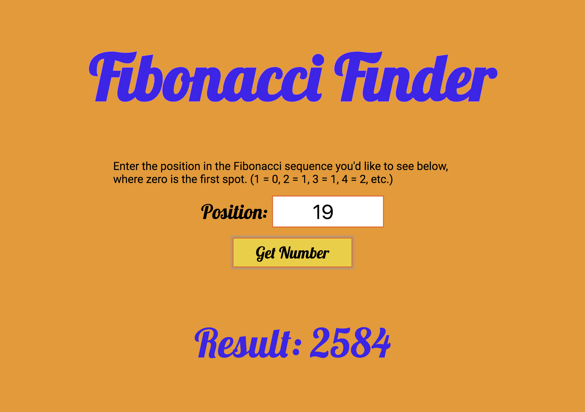

# fibonacci-react-redux

An app that displays the number representing the user's selected position in the [Fibonacci sequence](https://en.wikipedia.org/wiki/Fibonacci_number).

Built using React, Redux and SASS.

